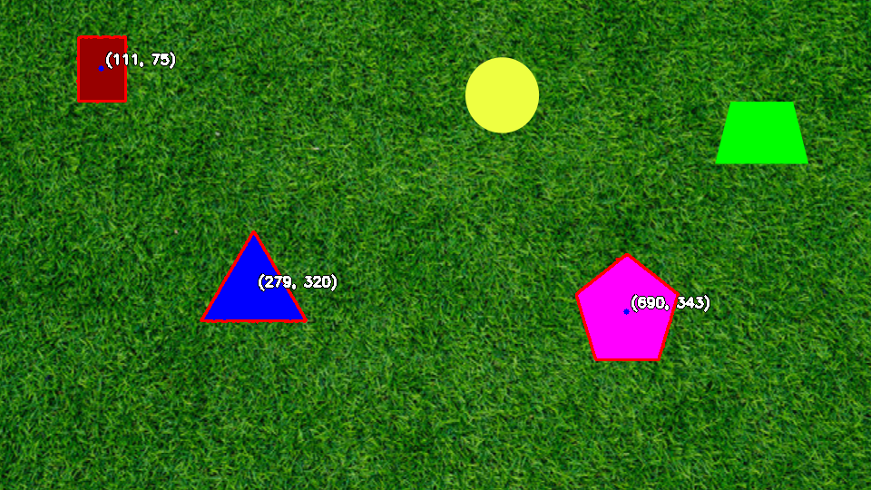

# PennAir 2025 - Shape Detection System

[](https://www.python.org/downloads/)
[](https://opencv.org/)
[](https://docs.ros.org/en/humble/)

A comprehensive computer vision system for detecting and analyzing geometric shapes in images and videos, developed for the PennAir 2025 Application Technical Challenge. The system provides real-time shape detection, contour tracing, center localization, and extends to 3D estimation with ROS2 integration.

## 🚀 Features

- **Multi-format Support**: Process static images and video streams
- **Shape Detection**: Accurate detection of circles, rectangles, triangles, and polygons
- **Contour Tracing**: Precise outline extraction with customizable parameters
- **Center Localization**: Geometric and mass center calculation
- **Background Agnostic**: Robust detection across varying backgrounds
- **3D Estimation**: Depth and pose estimation for detected shapes
- **ROS2 Integration**: Real-time processing with ROS2 Humble support
- **Occlusion Handling**: Basic support for partially occluded shapes

## 📁 Project Structure

```
pennair_2024_shape_detection/
├── src/
│   ├── scripts/
│   │   ├── run_static.py          # Static image processing
│   │   ├── run_video.py           # Video processing
│   │   ├── run_agnostic.py        # Background-agnostic detection
│   │   └── run_3d.py              # 3D estimation
│   ├── shape_detector/            # Core detection algorithms
│   └── ros2_nodes/                # ROS2 integration nodes
├── data/
│   ├── images/                    # Input images
│   └── videos/                    # Input videos
├── results/
│   ├── static/                    # Processed images
│   ├── video/                     # Processed videos
│   ├── agnostic/                  # Background-agnostic results
│   └── 3d/                        # 3D estimation outputs
├── docs/
│   └── approach.md                # Detailed methodology
├── launch/
│   └── shape_detection.launch.py  # ROS2 launch configuration
├── requirements.txt               # Python dependencies
├── region_props_acceleration(area_and_centroid).ipynb  # gpu acceleration implementation of region props functions for area and centroid
└── README.md
```

## 🛠️ Installation

### Prerequisites

- Python 3.10.13
- ROS2 Humble (for Part 5)
- OpenCV 4.x
- NumPy, SciPy, Matplotlib

### Setup Instructions

1. **Clone the repository:**
   ```bash
   git clone https://github.com/felicia-19/pennair.git
   cd pennair/pennair_2024_shape_detection
   ```

2. **Install Python dependencies:**
   ```bash
   pip install -r requirements.txt
   ```

3. **For ROS2 integration (optional):**
   ```bash
   # Ensure ROS2 Humble is installed
   colcon build --packages-select pennair_2024_shape_detection
   source install/setup.bash
   ```

## 🎯 Usage

### Static Image Processing

Process individual images for shape detection and analysis:

```bash
python src/scripts/run_static.py
```

**Output:** `results/static/processed_image.png`

### Video Processing

Analyze video streams with frame-by-frame shape detection:

```bash
python src/scripts/run_video.py
```

**Output:** `results/video/processed_video.mp4`

### Background-Agnostic Detection

Robust shape detection across varying backgrounds and lighting conditions:

```bash
python src/scripts/run_agnostic.py
```

**Output:** `results/agnostic/processed_video_hard.mp4`

### 3D Shape Estimation

Extract 3D properties and pose estimation from 2D detections:

```bash
python src/scripts/run_3d.py
```

**Output:** 
- `results/3d/processed_image.png` - Visualized 3D projections
- `results/3d/3d_results.csv` - Detailed 3D measurements

### ROS2 Integration

Launch the complete ROS2 pipeline for real-time processing:

```bash
ros2 launch pennair_2024_shape_detection shape_detection.launch.py
```

## 📊 Results & Examples

### Static Image Processing
*Processed image with detected shapes, outlined contours, and marked centers*



### Video Processing
*Real-time shape detection and tracking in video streams*


### Background-Agnostic Detection
*Robust detection across challenging backgrounds and lighting conditions*


### 3D Estimation Results

| Shape | Center (X,Y,Z) | Orientation | Area | Confidence |
|-------|----------------|-------------|------|------------|
| Circle | (245, 180, 15.2) | N/A | 1250.8 | 0.94 |
| Rectangle | (180, 120, 12.8) | 15.5° | 2100.4 | 0.91 |
| Triangle | (320, 200, 18.1) | -22.3° | 980.2 | 0.89 |

*See `results/3d/3d_results.csv` for complete analysis*

## 🔧 Configuration

### Input Configuration

- Place input images in `data/images/`
- Place input videos in `data/videos/`
- Supported formats: PNG, JPG, JPEG, MP4, AVI

### Detection Parameters

Key parameters can be adjusted in the respective script files:

```python
# Shape detection sensitivity
MIN_CONTOUR_AREA = 100
MAX_CONTOUR_AREA = 50000

# Edge detection thresholds
CANNY_LOWER = 50
CANNY_UPPER = 150

# Approximation accuracy for polygon detection
EPSILON_FACTOR = 0.02
```

## 🏗️ Technical Approach

### Shape Detection Pipeline

1. **Preprocessing**: Gaussian blur, noise reduction, color space conversion
2. **Edge Detection**: Canny edge detection with adaptive thresholding
3. **Contour Extraction**: Hierarchical contour detection and filtering
4. **Shape Classification**: Geometric analysis using contour approximation
5. **Center Calculation**: Moment-based centroid computation
6. **3D Estimation**: Perspective geometry and depth calculation

### Key Algorithms

- **Contour Approximation**: Douglas-Peucker algorithm for polygon simplification
- **Shape Classification**: Area ratio and convexity analysis
- **Center Detection**: Image moments (M10, M01, M00)
- **3D Reconstruction**: Single-view metrology with geometric constraints

## Additional Work 

The JN called region_props_acceleration(area_and_centroid) contains a quick demo of a replica I worked on for region_props functions that would allow for GPU acceleration. Profiling of these custom functions against region_props shows faster completion time while keeping results similar in values to the region_props output. 

#### Profiling of CPU-based method (region_props):
- Processing time: 4668.3832 seconds
- GPU Memory Used: 0.0 MB → 0.0 MB
- CPU Usage: 3.4% → 3.9%
- RAM Usage: 16274.54 MB → 16677.32 MB

#### Profiling of GPU-based method (torch):
- Processing time: 1078.3143 seconds
- GPU Memory Used: 0.0 MB → 201.0 MB
- CPU Usage: 3.3% → 3.7%
- RAM Usage: 15148.14 MB → 16086.41 MB

